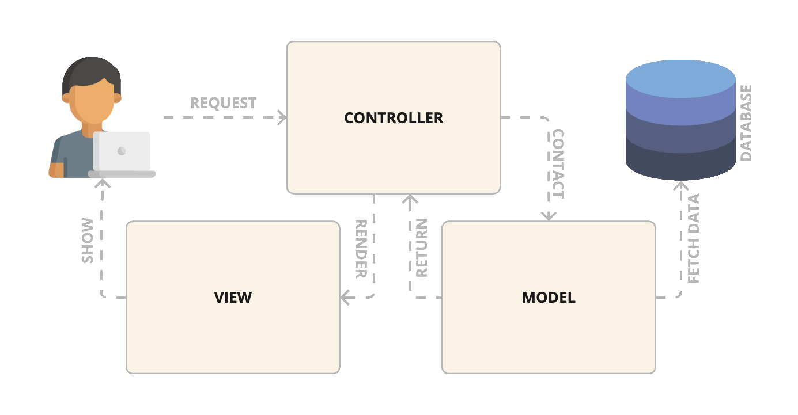

## Introduction

HAWKI2 is built on the Laravel framework, renowned for its robustness and ease of use in developing modern web applications. Laravel employs the Model-View-Controller (MVC) architecture, offering a plethora of tools and flexibility that enhance both development efficiency and application security.

This chapter discusses the general architecture of HAWKI2.

## MVC Architecture

### Model-View-Controller Pattern
The MVC architecture is a software design pattern that separates an application into three main logical components:

- **Model:** This component is responsible for managing data logic and interactions with the database. It represents the application's data structures and handles data-related tasks.

- **View:** The view is responsible for the presentation layer, displaying the user interface elements and rendering data to users.

- **Controller:** Controllers act as intermediaries between models and views. They process incoming requests, handle user input, execute business logic, and return the appropriate response.

### Benefits of MVC
- **Separation of Concerns:** MVC clearly separates the business logic from the user interface, simplifying maintenance and scalability of the code.
- **Reusability and Flexibility:** Facilitates code reuse and allows for easier adaptation to changes with minimized impact to other components.
- **Security:** Enhances security through an organized structure and Laravel’s built-in features like Cross-Site Request Forgery (CSRF) protection and authentication.

### Modular Design

HAWKI2 adopts a modular architecture, emphasizing the separation of concerns to enhance flexibility, scalability, and collaboration. This approach not only facilitates independent development but also supports the seamless integration of additional functionalities by the open-source community.
By adapting to these developers are able to expand the platform by adding their own moduls parallel to utilizing and expanding HAWKI core features and services.

[//]: # ()
[//]: # (## Routing)

[//]: # ()
[//]: # ()
[//]: # ([Read More]&#40;/architecture/Routing&#41;)

[//]: # ()
[//]: # ()
[//]: # (## Views)

[//]: # ()
[//]: # ()
[//]: # ()
[//]: # ()
[//]: # ([Read More]&#40;/architecture/Views&#41;)

[//]: # ()
[//]: # ()
[//]: # ()
[//]: # (## Models)

[//]: # ()
[//]: # (### Eloquent ORM)

[//]: # ()
[//]: # ()
[//]: # (### Defining Models)

[//]: # ()
[//]: # (### Relationships)

[//]: # (With Eloquent, managing relationships like one-to-one, one-to-many, many-to-many, etc., becomes straightforward, allowing developers to retrieve related data efficiently.)

[//]: # ()
[//]: # (## Services)

[//]: # ()
[//]: # (### Service Layer)

[//]: # (A service layer organizes complex business logic or interactions with third-party services, promoting a clean separation of concerns and code reusability.)

[//]: # ()
[//]: # (### Service Providers)

[//]: # (Service providers are instrumental in binding classes to the service container, contributing to the flexibility and decoupling of application services.)

[//]: # ()
[//]: # (## Additional Considerations)

[//]: # ()
[//]: # (### Middleware)

[//]: # (Middleware alters or filters HTTP requests entering your application, useful for handling tasks like authentication, logging, and more.)

[//]: # ()
[//]: # (### Dependency Injection)

[//]: # (Leverage Laravel’s service container to perform dependency injection, promoting modular development and ease of testing.)

[//]: # ()
[//]: # (### Testing)

[//]: # (Laravel supports comprehensive testing through unit and feature tests, ensuring reliability and robustness of application features.)

[//]: # ()
[//]: # (### Localization)

[//]: # (Laravel's support for localization lets you cater to a global audience by supporting multiple languages, if applicable to your project needs. -->)
