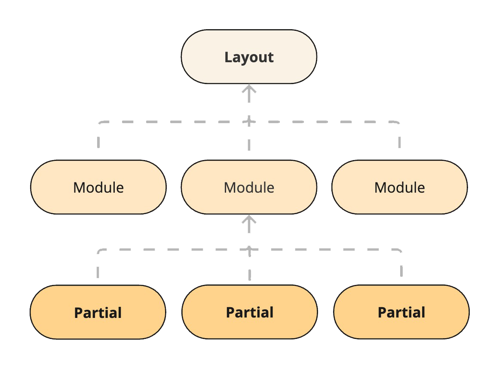
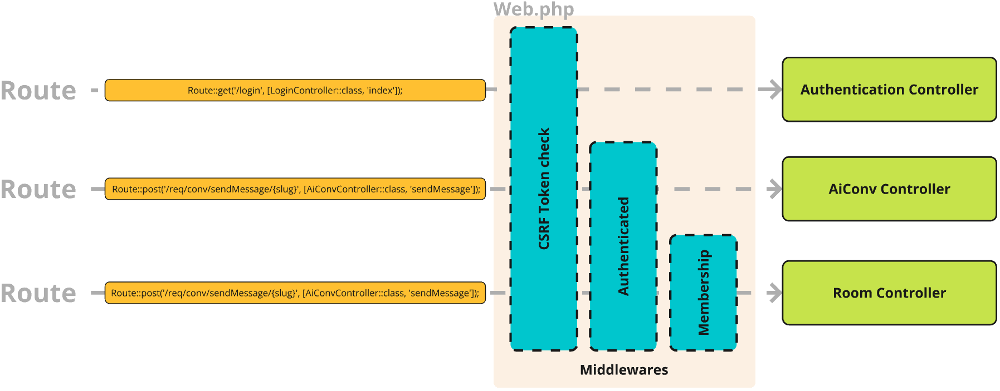

# Models Views Controllers
## Introduction


## Models

Eloquent, Laravel's Object Relational Mapping (ORM) system, simplifies data interactions with the database using an expressive syntax that provides intuitive database table management.
Models are defined to represent database tables and manage data. They encapsulate business logic, queries, and validation rules.
Each model also includes a migration file, which is responsible for creating the necessary tables for each model in the database when the project is initialised.
Models also define relationships and may include functions for fetching and processing data.

The following chart shows a short summery of each model in HAWKI.

| Model            | Description                                             |
|------------------|---------------------------------------------------------|
| AiConv           | Private conversation with AI                            |
| AiConvMsg        | The message belonging an AiConv                         |
| AiModelStatus    | Latest status of the model                              |
| Announcement     | The published Announcement                              |
| AnnouncementUser | Relation of the published Announcement to User Reaction |
| Attachment       | The Attachment belonging a Message or AiConvMsg         |
| Invitation       | Invitation for a User in a Room                         |
| Member           | Membership variables of a User in a Room                |
| Message          | The message belonging to a Room                         |
| PasskeyBackup    | Backup of the encrypted user passkey                    |
| PrivateUserData  | Keychain backup and other private information of a user |
| Room             | The Group chat room                                     |
| UsageRecord      | Record of Token usage for each Ai generated message.    |
| User             | Registered user on HAWKI, also used by Auth facade      |


## Views

HAWKIs frontend is based on Laravel Blade. By using powerful features of the blade HAWKI interface is divided into three different layers, **layouts**, **modules**, and **partials**

As **layoutes** contain the general structure of the page, like *login* or *home*, **modules** are the main content structure yielded in one of the layouts, such as *chat*, *groupchat*, *profile*. Likewise **partials** are smaller UI components loaded in each module.




**Templates**

Dynamic instantiated partials, such as messages, chat history or room list items are prepared as templates and included in `/views/partials/home/templates.blade.php`. These template nodes are later cloned and added dynamically to the interface.

**Icons**

To create a cleaner and more readable code base, the SVG icons are added using `<x-icon/>` in the DOM which are converted by Blade-UI-Kit library.
The `SVG` files are place inside `/resources/icons` folder

To add new icons:˜
- copy the svg file in `resources/icons/` folder,
- add the icon to DOM as:
```html
<x-icon name="myicon"/>
```


## Controllers

Controllers are the main layer between the routes and backend logic. The main responsibility of each controller is to receive the requests from frontend, validate them and allow them into the logic level of the backend.

Before receiving the Request, the controllers are also protected by middlewares. These middlewares determine if the requester meets the required condition to access a specific route.

The following chart shows a short summery of each controller.

| Controller               | Description                                                                                                                                                                               |
|--------------------------|-------------------------------------------------------------------------------------------------------------------------------------------------------------------------------------------|
| AiConvController         | Handles requests related to a user conversation (aka. single chat)                                                                                                                        |
| AnnouncementController   | Handles requests related to a Announcements.                                                                                                                                              |
| AuthenticationController | Handles login requests. Based on the authentication mechanism utilizes one of the dedicated services (LDAP, Shibboleth, OpenID) to authenticate users and redirect them to the home page. |
| HomeController           | Handeling render requests after authentication as well as session attributes                                                                                                              | |
| InvitationController     | Handeling and storing all of the user invitation logics                                                                                                                                   |
| LanguageController       | Provides language and translation data for rendering views                                                                                                                                |
| LoginController          | Prepares the components and renders the login page.                                                                                                                                       |
| ProfileController        | Handels requests related to user profiles, and secrets.                                                                                                                                   |
| RoomController           | Handles requests related to Rooms (aka. Groupchats)                                                                                                                                       |
| StreamController         | Handles all of the internal and external requests to an AI models including creating the payload, connection to AI models, and manipulating the response data.                            |


## Routes

Routing is a core aspect in MVC architecture, directing URLs to specific controllers and actions. It defines how users interact with the application by mapping HTTP requests to application logic. Routes are defined in `routes/web.php` for web interfaces and `routes/api.php` for API endpoints.

Each route in the application is responsible for directing a request to a specific function within its designated controller. To maintain clarity and organization, no business logic is directly implemented within the web.php or api.php files. Instead, logic is encapsulated within separate functions in the controllers.





Routes that handle application requests are prefixed with `/req/`, which distinguishes them from routes intended for rendering views. This clear distinction ensures the routes associated with rendering views directly describe the target view, promoting readability and easier navigation within the codebase.

*Example:*
```JS
// Render Login View
Route::get('/login', [LoginController::class, 'index']);
// Send Login Request
Route::post('/req/login-ldap', [AuthenticationController::class, 'ldapLogin']);
```

|Facade| Method | Route | Controller | Function |
|------|--------|-------|------------|----------|
|Route::| get | '/login' | LoginController::class | 'index' |


To decrease the time required to register the defined routes, it's recommended to cache the routes, when deploying HAWKI on your webspace, using:

```bash
php artisan route:cache
```

However, after updating or modifying the routes, this cache should be cleared and redone if necessary:

```bash
php artisan route:clear
php artisan route:cache
```

To list the registered routes use:

```bash
php artisan route:list
```


----
### Middleware

Middlewares provide a filtering mechanism for HTTP requests, which ensures the safety of the routes from various attacks or unauthorized access.
There are several middlewares implemented in HAWKI, which beside the built in Laravel middlewares restrict and filter routes.

Middlewares can be applied to a single route:

```
Route::get('/register', [AuthenticationController::class, 'register'])->middleware('registrationAccess');
```
or a group of routes:
```
Route::middleware('registrationAccess')->group(function () {

    Route::get('/register', [AuthenticationController::class, 'register']);
    ...
});
```

**Aliases**

Each middleware is registered with a shorter alias in the `AppServiceProvider.php` for better readablity in the code.

```js
Route::aliasMiddleware('registrationAccess', RegistrationAccess::class);
```


Here is short description of the main middlewares in HAWKI

- **CSRF Token Validation**
  By default `ValidateCsrfToken` middleware is included in the `web` middleware. It means that all of the POST routes registered in `web.php` will be checked for the `X-CSRF-TOKEN` in the header of the request to protect the routes from [Cross-site request forgery](https://en.wikipedia.org/wiki/Cross-site_request_forgery).


- **Authentication**

`auth` middleware is also one of the built-in middlewares, which works as a part of the `Illuminate\Support\Facades\Auth` facade with the main responsibility to allow access only to the authenticated clients.

For more information refer to the [Authentication Section](8-Authentication.md)


- **Sanctum Authentication**

In HAWKI 2 users are able to create API tokens and use them in the external applications. The token creation and management is done by Laravel Sanctum. Sanctums auth middleware ensures that the request inclued the authentication token in the header. Accordingly compares the token with the assigned tokens to HAWKI users and authenticates them before passing the request to controller.


- **Registration Access**

As the user is logging in for the first time on HAWKI, a temporary access is granted until completing the registration and before completing the handshake and logging the user in. At this point the client is allowed to access specific routes such as receiving encryption salts from the server or setup and backup registration data.

>**Important:**
`auth` middleware bypasses the `RegistrationAccess`. In other words if the user is already logged in, they can access the routes which are protected by `RegistrationAccess`.


- **Session Expiry Check**

This middleware checks the idle time of the session. This way if the Session is already ended by the built in garbage collection mechanism of PHP, the user will be redirected to the login page, when trying to send any request.

>Although the same logic applies if the user reloads the page, before reloading, the frontend side will still try to send requests but will throw errors instead.

>The frontend session timer also ensures that the user is informed about the session timout event.


- **PreventBackHistory**

Browsers by default use the cached data when trying to navigate in the website by using history forward and back buttons. This will be problematic as the logged out user can still use back button to navigate to the home page, although the session does not exist anymore.
This middleware ensures that the navigation using with the cached data is not possible.


- **Admin Access & Editor Access**

The defined roles in the Groupchat restrict users' access to the room.
To ensure that the user sending the request is a member with the required access level, `AdminAccess` and `EditorAccess` check the member role before passing the request to the controller.


- **External Communication Check**

As described in the Sanctum Authentication above, users can access the API endpoint using their token. However, the .env variable `ALLOW_EXTERNAL_COMMUNICATION` allows the server admin to turn this feature on or off. In the scenario when external communication has been previously allowed and turned off afterwards, sanctum still is active and will check the provided tokens. In this case `ExternalCommunicationCheck` in parallel ensures that this is allowed.


---
### Common Problems


**1- The newly added routes return 404 error.**

- Make sure the route path and the path defined in the fetch request are identic.
>use network tab in the inspect element to make sure the request url is the same as the one in code.
If not, empty cache and reload the browser to update to the newer version of the script.

- Make sure the controller class and function are correct and exist.
- Refresh the route cache:
```bash
php artisan route:clear
php artisan route:cache //Optional
```

- Check if the route is listed correctly.
```bash
php artisan route:list
```


**2- Route is listed correctly but the request still throws 404 error.**

If the solution in the previous step did not solve the problem: The problem may be caused by a middleware.

- Check if there is a middleware filtering the route. If so try to temporarly move the route of the middleware group or remove the middleware assigned to the route. If this solved the issue the request is blocked by the middleware.

- Check if the middleware exists in the `app/http/Middleware` folder. Also check if the name or alias in `AppServiceProviders.php` as well as the routes file is correct.

- Try clearing config and cache:

```
php artisan config:clear
php artisan cache:clear
php artisan route:clear
php artisan view:clear
```

- Try restarting artisan server if in local development mode.


