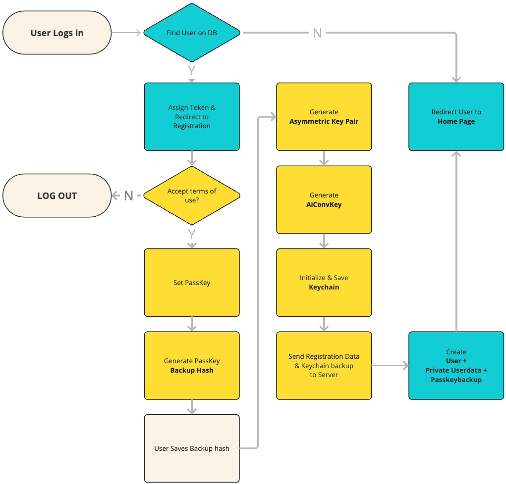
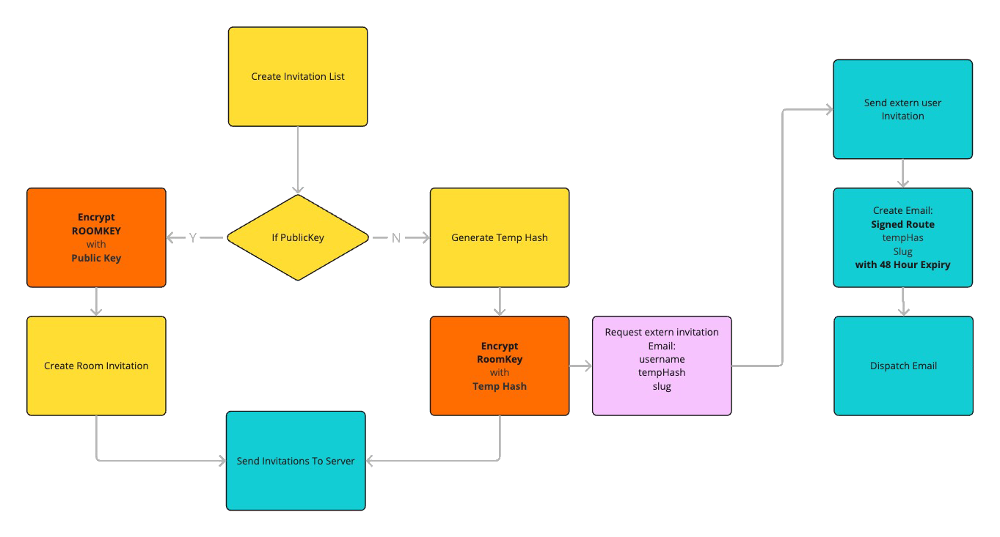

## Introduction

Encryption can be one of the more complicated parts of HAWKI2.
Basically, most of the encryption in HAWKI is done on the client side. This ensures that a minimum of data leaves the browser unencrypted. In addition to the SSL encryption after deployment, this also guarantees the integrity of the data all over the platform.

To review the encryption process, we start with the registration process and the creation of the required keys during the process when the user first enters the platform. As mentioned in the introduction, HAWKI's main authentication mechanism relies on external authentication services (LDAP, Shibboleth, OpenID). Although this facilitates the integration of HAWKI into an organisation's infrastructure, such as universities and companies, it also makes it more difficult to monitor changes in user information. In this respect, HAWKI's encryption is based on a unique passkey that gives each user a unique signature to encrypt and store their private data. We have adapted two terms in the frontend for users to make them easier to understand. The "passkey" described here has been renamed for the user to "Datakey" and the "backup code" described here is called "Wiederherstellungscode" for users.

---
## Registration

The first time users log in to HAWKI, they must go through the registration process, during which HAWKI2 establishes a secure encryption infrastructure that both protects individual user data and enables secure communication between users.
The registration process involves the creation of several cryptographic keys:

**1. Passkey Creation**
    - Users create a master passkey during registration
    - This passkey serves as the root of the encryption system
    - A backup code is generated in the format "xxxx-xxxx-xxxx-xxxx"
    - The passkey is encrypted using a key derived from this backup code and stored server-side
    - The backup mechanism allows recovery if the user forgets their passkey

**2. Key Pair Generation**
    - An RSA-OAEP key pair (2048-bit) is generated for asymmetric encryption
    - The public key is stored in the user's database record for others to encrypt messages to them
    - The private key is stored in the user's encrypted keychain
    - This key pair enables secure key exchange between users

**3. AI Conversation Key Creation**
    - An AES-256-GCM symmetric key is generated for AI conversations
    - This key is stored in the user's keychain and used to encrypt all AI conversation data (single chats)

**4. Keychain Initialization**
    - User's keychain stores all cryptographic material (private key, symmetric keys)
    - The keychain itself is encrypted using a key derived from the user's passkey
    - Both client-side (IndexedDB) and server-side backups of the encrypted keychain are maintained

> *After each login, the keychain on the indexDB will be compared to the one on the Server and will be updated if neccessary.*

---
## Message Encryption

### AI Conversation Messages (AiConvMsg)

AI conversation messages are encrypted using the user's AI conversation key.
Since the conversation (single chat) data only belongs the user, and since the conversation is mostly done using streaming, only one symmetric key (`AiConvKey`) is used for encryption both client and AI messages, which reduces the processing load drastically.
On the other hand since the none of the keys is allowed to be sent to server, the AI messages must also be encrypted on the client side and be sent back to the server.
To solve this problem, two copies of the user message are sent to the server via different routes: An encrypted copy that is stored in the database as `AiConvMsg`, and an unencrypted copy that is sent to the AI model.

**1. User Messages to AI**
    - Messages are encrypted client-side using the user's aiConvKey (AES-256-GCM)
    - The encrypted message, along with its IV and authentication tag, is sent to the server
    - The server never sees unencrypted message content

**2. AI Responses**
    - AI responses are streamed to the client in chunks for real-time display
    - As chunks arrive, they're displayed to the user immediately
    - Once the complete response is received or the stream is aborted, it's encrypted with the aiConvKey
    - The encrypted response is sent to the server for storage

**3. Storage and Retrieval**
    - All messages are stored in the database in encrypted form
    - When a conversation is loaded, messages are fetched and decrypted client-side
    - The system prompt for AI conversations is also encrypted with the same key

### Room Messages

Messages in group chats (rooms) use a room-specific encryption system:

**1. Room Key**
    - Each room has a unique symmetric AES-256-GCM key
    - This key is shared among all room members through secure key exchange
    - The room key is stored in each member's encrypted keychain

**2. User Message Encryption**
    - User messages are encrypted with the room key before being sent
    - The encrypted message includes an IV and authentication tag
    - Only members with access to the room key can decrypt these messages

**3. AI Message Encryption**
    - AI messages in group chats use a derived key from the room key
    - The derivation uses PBKDF2 with a server-provided salt and the room slug as context
    - This special AI encryption key allows the server to directly store AI messages in the database
    - When decrypting messages the AI encryption key will be derived again from the original room key.

## Key Exchange

When a user creates a room or invites others to join, a secure key exchange occurs:

**1. For Users with Public Keys**
    - The room key is encrypted using the recipient's public key (RSA-OAEP)
    - This asymmetric encryption ensures only the recipient can decrypt the room key
    - The encrypted key is stored in the database as part of the invitation
    - When the recipient accepts the invitation, they decrypt the room key using their private key

**2. For External Users without Public Keys**
    - A temporary hash is generated for secure key sharing
    - The room key is encrypted using a key derived from this temporary hash
    - The encrypted key and temporary hash are stored separately
    - The hash is sent to the user via email
    - When the user registers and accepts the invitation, they use the hash to decrypt the room key
    
**3. Adding the Room Key to Keychain**
    - After successful decryption, the room key is added to the user's keychain
    - The keychain is re-encrypted and backed up to the server
    - This process ensures the room key remains secure and persistent

## Private Data Encryption

  HAWKI2 protects various types of private user data through encryption:

**1. User Keychain**
    - Stores all cryptographic keys (private key, room keys, AI key)
    - Encrypted using a key derived from the user's passkey
    - The derivation process uses PBKDF2 with 100,000 iterations and SHA-256
    - Server-provided salts enhance security and prevent rainbow table attacks

**2. Room Metadata**
    - Room descriptions and system prompts are encrypted with the room key
    - This ensures that even room configuration data remains private

**3. Passkey Backup**
    - The user's passkey is encrypted using a key derived from their backup code
    - This allows recovery without compromising the security of the passkey

**Security Considerations**

**1. Zero-Knowledge Architecture**
    - The server never has access to unencrypted keys or message content
    - All encryption and decryption happens client-side in the browser

**2. Key Management**
    - Private keys never leave the client device in unencrypted form
    - All key transfers utilize asymmetric encryption or secure key derivation

**3. Cryptographic Standards**
    - Uses industry-standard algorithms: AES-256-GCM, RSA-OAEP, PBKDF2
    - Proper implementation of IVs, authentication tags, and salts

**4. Sync and Recovery**
    - Encrypted keychain backup enables cross-device synchronization
    - Backup codes provide a secure recovery mechanism

**5. Isolation**
    - Each conversation and room has its own encryption keys
    - Compromise of one key doesn't affect the security of other communications

  This comprehensive encryption system ensures that all user data and communications in HAWKI2 remain
  private and secure, with the server acting only as a secure relay for encrypted content.
