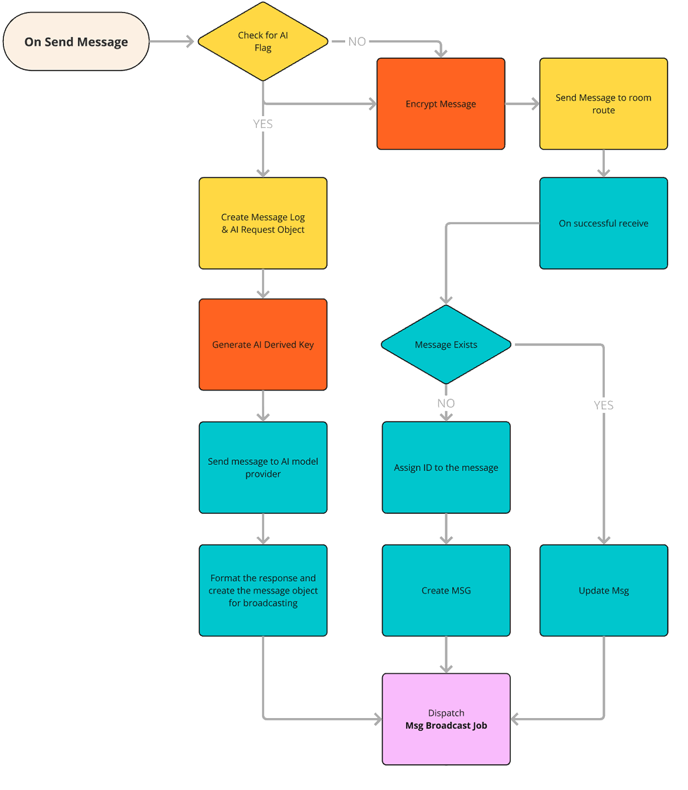
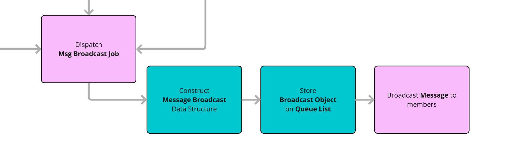

## Overview of the Broadcasting Process

The HAWKI2 system implements a robust message broadcasting architecture to deliver real-time encrypted
messages to all members of a room. This process combines Laravel's queueing and broadcasting systems to
ensure efficient and reliable delivery while maintaining end-to-end encryption.

As is metioned in the [Encryption](4-Encryption.md) section, in the groupchat rooms if the AI model is mentioned in the message, the chatlog will be prepared and sent to StreamController, also including a derived encryption key to be used by the server.
After receiving the answer from the AI model, the server needs to broadcast the message to all the room members, that have established the connection through websocket channels.





### Broadcasting Flow

**1. Message Creation and Encryption**
    - When a user sends a message, it's first encrypted client-side using the room key
    - The encrypted message (ciphertext, IV, and tag) is sent to the server
    - The server creates a message record in the database

**2. Job Dispatching**
    - After persisting the message, the RoomController dispatches a SendMessage job:
        ```js
        SendMessage::dispatch($message, false)->onQueue('message_broadcast');
        ```
    - This job is placed on a dedicated queue named 'message_broadcast'
    - The queue allows the server to handle broadcasting asynchronously without blocking the response

**3. Queue Processing**

    - Laravel's queue worker processes the queued job
    - The system uses a database queue driver (configured in `queue.php`)
    - This ensures messages are not lost if the system crashes during processing

**4. Broadcasting Event Creation**

    - The SendMessage job prepares message data and creates a RoomMessageEvent
    - This event includes all encrypted message data
    - The event is formatted with metadata needed by clients for proper handling

**5. Event Broadcasting**

    - The RoomMessageEvent implements Laravel's ShouldBroadcast interface
    - The event is broadcasted to a private channel specific to the room:
        ```js
        public function broadcastOn(): array {
            $slug = Room::findOrFail($this->data['messageData']['room_id'])->slug;
            return [new PrivateChannel('Rooms.' . $slug)];
        }
        ```
**6. WebSocket Delivery**

    - Laravel Reverb (configured in `reverb.php`) handles the WebSocket connections
    - Laravel Echo on the client side listens for these events
    - The connection is authenticated using Laravel Sanctum





### Client-Side Reception

**1. Channel Subscription**

When a user enters a room, the client subscribes to the room's private channel:
```js
window.Echo.private(webSocketChannel)
    .listen('RoomMessageEvent', async (e) => {
        // Handle the incoming message
    });
```

**2. Message Processing**

  Upon receiving a message, the client:
      - Retrieves the appropriate key from the user's keychain
      - Decrypts the message using the room key or AI key
      - Updates the UI with the decrypted content

**3. Typing Indicators**

    - Real-time typing indicators use **whisper channels**
    - These side-channel communications don't persist to the database
    - Provide immediate feedback without requiring full broadcasts


## Libraries and Technologies

The broadcasting system leverages several key technologies:

**1. Laravel Echo**
    - Client-side JavaScript library for subscribing to WebSocket channels
    - Handles connection maintenance and reconnection logic
    - Provides a simple API for listening to events

**2. Laravel Reverb**
    - WebSocket server implementation by Laravel
    - Configured as the primary broadcast driver
    - Handles authentication, channel management and scaling

**3. Laravel Queues**
    - Uses the database driver for reliable message processing
    - Separates the broadcasting process from the web request cycle
    - Allows for better performance and fault tolerance

**4. Laravel Events**
    - The event system ties everything together
    - RoomMessageEvent class defines the data structure and target channels
    - Implements ShouldBroadcast for automatic WebSocket delivery


## Security Considerations

**1. Private Channels**
    - All communication happens on private channels that require authentication
    - Channel names include the room slug, isolating conversations

**2. End-to-End Encryption**
    - All message content remains encrypted throughout the broadcasting process
    - The server only routes the encrypted data without access to decryption keys

**3. Authentication**
    - Channel subscriptions are authenticated via Laravel Sanctum
    - Only room members can subscribe to the room's channel

This comprehensive broadcasting architecture ensures that messages are delivered efficiently and
securely to all room members, maintaining the end-to-end encryption that is core to HAWKI2's security
model.
